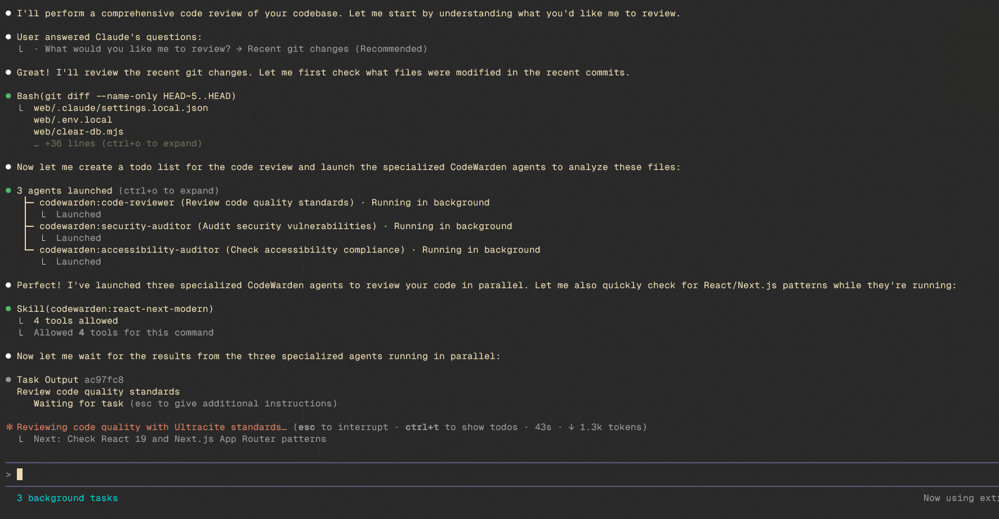

# CodeWarden

> Enforce code quality and modern development practices

[](https://opensource.org/licenses/MIT)
[](https://github.com/tylerbryy/codewarden)

**Created by [Tyler Gibbs](https://www.tylergibbs.dev/about)**

## Overview

CodeWarden is a Claude Code plugin for enforcing modern development practices, code quality standards, and security best practices in TypeScript/React/Next.js applications. The plugin ensures your code meets strict standards for quality, accessibility, and security.

## Demo



## Installation

### Option 1: Install from GitHub (Recommended)

```bash
# In Claude Code
/plugin marketplace add https://github.com/tylerbryy/codewarden

# Install the plugin
/plugin install codewarden
```

### Option 2: Install from Local Marketplace

```bash
# Clone the repository
git clone https://github.com/tylerbryy/codewarden.git
cd codewarden

# Add local marketplace
/plugin marketplace add ./

# Install the plugin
/plugin install codewarden
```

### Option 3: Team Installation (Repository Level)

Add to your project's `.claude/settings.json`:

```json
{
  "pluginMarketplaces": [
    "https://github.com/tylerbryy/codewarden"
  ],
  "plugins": {
    "codewarden": {
      "enabled": true
    }
  }
}
```

When team members trust the repository, the plugin installs automatically.

## Quick Start

1. Install the plugin (see Installation above)

2. Run a code review:
   ```bash
   /code-review
   ```

3. Perform a security audit:
   ```bash
   /security-audit
   ```

4. Fix common anti-patterns:
   ```bash
   /fix-patterns
   ```

5. Deploy to Vercel:
   ```bash
   "Deploy my app to Vercel"
   ```

6. The skills activate automatically when you:
   - Write TypeScript/React code
   - Review pull requests
   - Implement forms or mutations
   - Work with Server Components/Actions
   - Ask about performance optimization
   - Request UI/design reviews
   - Deploy applications

## Features

### Agent Skills

#### Ultracite - Code Quality Enforcer
Strict enforcement of type safety, accessibility standards, and code quality rules based on Biome's linter.

- Type Safety: No `any`, proper TypeScript patterns, enum to const objects
- Accessibility: WCAG compliance, proper ARIA attributes, semantic HTML
- Modern JavaScript: Arrow functions, template literals, optional chaining
- React Best Practices: Proper keys, hook dependencies, component patterns
- Next.js Optimization: Image optimization, proper imports, App Router patterns

#### React Next Modern - Architectural Patterns
Enforce React 19 and Next.js App Router best practices with server-first architecture.

- Server Components: Async-native data fetching, request memoization
- Server Actions: Secure mutations with validation and auth
- Form Hooks: useActionState, useFormStatus, useOptimistic
- Performance: Eliminate waterfalls, optimize bundles
- Security: Input validation, authentication, rate limiting

#### UI/UX Guidelines - Accessibility & Design
Comprehensive UI/UX best practices for accessible, performant, and delightful interfaces.

- Keyboard Navigation: Full WCAG compliance, focus management
- Touch Targets: Mobile-friendly hit areas (≥44px)
- Accessibility: ARIA labels, semantic HTML, screen reader support
- Animations: prefers-reduced-motion support, compositor-friendly properties
- Forms: Proper validation, error handling, password manager support
- Performance: Image optimization, virtualized lists, minimal re-renders, Web Workers
- Internationalization: Locale-aware formatting, non-breaking spaces
- Copywriting: Clear, actionable messaging (includes Vercel style guide)
- Browser Quirks: SVG transforms, Windows select backgrounds, cross-browser compatibility

#### React Best Practices - Performance Optimization
React and Next.js performance optimization guidelines from Vercel Engineering, ordered by impact.

- **Critical - Eliminate Waterfalls**: Promise.all() for parallel async, start promises early, Suspense boundaries
- **Critical - Bundle Size**: Avoid barrel imports, use next/dynamic, defer third-party libraries, preload on intent
- **High - Server Performance**: React.cache() for deduplication, LRU cache for cross-request, minimize RSC serialization
- **Medium - Client Data Fetching**: SWR for automatic deduplication, defer state reads, derived state subscriptions
- **Medium - Re-render Optimization**: useMemo/useCallback strategically, startTransition for non-urgent updates
- Includes 39 individual rule files organized by category (async, bundle, server, client, rerender, rendering, js, advanced)

#### Vercel Deploy - Instant Deployment
Deploy any project to Vercel instantly without authentication.

- No auth required - returns preview URL and claimable deployment link
- Auto-detects 40+ frameworks (Next.js, Remix, Astro, SvelteKit, Vue, Angular, etc.)
- Supports directory or tarball deployment
- Static HTML project support with automatic index.html handling
- Includes ready-to-run `deploy.sh` script

#### Vercel Design Guidelines - UI Auditing
Review web interfaces against Vercel's comprehensive design guidelines.

- **Interactions**: Keyboard accessibility, focus management, hit targets, loading states
- **Animations**: Reduced motion, GPU acceleration, easing, interruptibility
- **Layout**: Optical adjustment, alignment, responsive testing, safe areas
- **Content**: Inline help, skeletons, empty states, typography, accessibility
- **Forms**: Labels, validation, autocomplete, error handling, submit behavior
- **Performance**: Re-renders, layout thrashing, virtualization, preloading
- **Design**: Shadows, borders, radii, contrast, color accessibility
- **Copywriting**: Active voice, title case, clarity, error messaging

### Slash Commands

#### `/code-review`
Code review with Ultracite and React/Next.js patterns
```bash
/code-review                    # Review recent changes
/code-review web/src/app        # Review specific directory
/code-review Auth.tsx           # Review specific file
```

#### `/fix-patterns`
Automatically detect and fix common anti-patterns
```bash
/fix-patterns                   # Interactive mode
/fix-patterns --dry-run         # Preview changes
/fix-patterns --type=var        # Fix specific patterns
```

#### `/migrate-to-app-router`
Migrate Next.js Pages Router to App Router with Server Components
```bash
/migrate-to-app-router          # Full migration guide
/migrate-to-app-router --analyze-only  # Show plan only
```

#### `/security-audit`
Security audit of your application
```bash
/security-audit                 # Full security scan
/security-audit --critical-only # Show critical issues only
/security-audit --fix           # Auto-fix safe issues
```

### Specialized Agents

#### code-reviewer
Code quality reviewer
- Reviews against Ultracite, React patterns, and UI/UX guidelines
- Identifies type safety, security, and accessibility issues
- Provides specific fixes with file:line references
- Prioritized findings (Critical/High/Medium/Low)

#### code-refactorer
Expert in refactoring code to modern patterns while preserving functionality
- Incremental, safe refactoring
- Type safety improvements
- Performance optimization
- Component extraction

#### security-auditor
Specialized in identifying and fixing security vulnerabilities
- Server Action security
- Authentication/authorization audits
- SQL injection prevention
- XSS vulnerability detection
- Dependency security checks

#### pattern-detector
Anti-pattern detection and automated fixing specialist
- Detects var/enum/any usage and other code smells
- Supports --dry-run and --type=X flags
- Validates fixes with TypeScript compiler
- Groups findings by pattern type

#### migration-planner
Next.js Pages Router to App Router migration expert
- Analyzes existing Pages Router structure
- Creates phased migration roadmap
- Converts getServerSideProps to Server Components
- Splits Server/Client components correctly

#### accessibility-auditor
WCAG 2.1 AA compliance specialist
- Keyboard navigation verification
- ARIA and semantic HTML checks
- Color contrast validation
- Screen reader compatibility
- Mobile touch target verification

### Automation Hooks

- Session Start: Welcome message with plugin capabilities
- Unsafe Command Prevention: Blocks destructive bash commands (rm -rf, dd, fork bombs, etc.)
- Auto-Format Suggestions: Suggests running Biome formatter after TypeScript/JavaScript edits

## Usage Examples

### Enforce Code Quality

The Ultracite skill automatically enforces rules when you write code:

```typescript
// Bad - Claude will suggest fixing these:
var count = 0                              // Use const/let
enum Status { ACTIVE }                     // Use as const
function process(data: any) {}             // Use specific types
items.map((item, i) => <div key={i}>)     // Use proper keys

// Good - Claude will guide you to write:
let count = 0
const Status = { ACTIVE: 'active' } as const
function process(data: User) {}
items.map(item => <div key={item.id}>)
```

### Modern React Patterns

The React Next Modern skill enforces server-first architecture:

```typescript
// Bad - Claude will suggest refactoring:
"use client"
function Page() {
  const [data, setData] = useState([])
  useEffect(() => {
    fetch('/api/data').then(r => r.json()).then(setData)
  }, [])
}

// Good - Claude will guide you to:
async function Page() {
  const data = await db.query.data.findMany()
  return <DataList data={data} />
}
```

### Secure Server Actions

The security-auditor agent ensures your Server Actions are secure:

```typescript
// Bad - Claude will flag security issues:
"use server"
export async function updateUser(data: any) {
  await db.update(users).set(data)
}

// Good - Claude will guide you to:
"use server"
import { z } from 'zod'
import { auth } from '@/lib/auth'

const schema = z.object({
  name: z.string().min(2),
  email: z.string().email()
})

export async function updateUser(formData: FormData) {
  const session = await auth()
  if (!session?.user) throw new Error('Unauthorized')

  const data = schema.parse({
    name: formData.get('name'),
    email: formData.get('email')
  })

  await db.update(users)
    .set(data)
    .where(eq(users.id, session.user.id))

  revalidatePath('/profile')
}
```

## Plugin Structure

```
codewarden/
├── .claude-plugin/
│   ├── plugin.json           # Plugin metadata
│   └── marketplace.json      # Marketplace configuration
├── skills/
│   ├── ultracite/
│   │   └── SKILL.md          # Code quality rules
│   ├── react-next-modern/
│   │   └── SKILL.md          # React/Next.js patterns
│   ├── ui-ux-guidelines/
│   │   ├── SKILL.md          # UI/UX best practices
│   │   └── AGENTS.md         # Agent integration reference
│   ├── react-best-practices/
│   │   ├── SKILL.md          # Performance optimization guide
│   │   └── references/
│   │       ├── react-performance-guidelines.md
│   │       └── rules/        # 39 individual rule files
│   ├── vercel-deploy/
│   │   ├── SKILL.md          # Deployment instructions
│   │   └── scripts/
│   │       └── deploy.sh     # Deployment script
│   └── vercel-design-guidelines/
│       └── SKILL.md          # Design audit guidelines
├── commands/
│   ├── code-review.md        # Code review command
│   ├── fix-patterns.md       # Pattern fixing command
│   ├── migrate-to-app-router.md  # Migration guide
│   └── security-audit.md     # Security audit command
├── agents/
│   ├── code-reviewer.md      # Code quality reviewer
│   ├── code-refactorer.md    # Refactoring agent
│   ├── security-auditor.md   # Security vulnerability scanner
│   ├── pattern-detector.md   # Anti-pattern detector
│   ├── migration-planner.md  # App Router migration planner
│   └── accessibility-auditor.md  # Accessibility compliance checker
├── hooks/
│   └── hooks.json            # Automation hooks
├── README.md                 # This file
└── LICENSE                   # MIT License
```

## Configuration

### Customize Hook Behavior

Hooks are configured in `hooks/hooks.json`. To disable a hook, remove it from the configuration:

```json
{
  "hooks": {
    "SessionStart": [
      {
        "matcher": "",
        "hooks": [
          {
            "type": "command",
            "command": "echo 'Welcome!'"
          }
        ]
      }
    ]
  }
}
```

### Adjust Skill Activation

Skills activate automatically based on context. To manually invoke:

```bash
# Ask Claude to use a specific skill
"Review this code using Ultracite standards"
"Refactor this to use React Server Components"
```

## Development

### Local Development

```bash
# Clone the repository
git clone https://github.com/tylerbryy/codewarden.git
cd codewarden

# Make your changes to skills, commands, or agents

# Test locally
/plugin marketplace add ./
/plugin install codewarden
```

### Contributing

We welcome contributions. Please:

1. Fork the repository
2. Create a feature branch (`git checkout -b feature/amazing-feature`)
3. Commit your changes (`git commit -m 'Add amazing feature'`)
4. Push to the branch (`git push origin feature/amazing-feature`)
5. Open a Pull Request

### Publishing Updates

```bash
# Update version in .claude-plugin/plugin.json
# Commit and tag
git commit -am "Release v1.1.0"
git tag v1.1.0
git push origin main --tags
```

## Philosophy

This plugin is built on these core principles:

1. Safety First: Never break working code
2. Server-First: Leverage Server Components and Server Actions
3. Type Safety: Strict TypeScript with no escape hatches
4. Accessibility: WCAG compliance is non-negotiable
5. Security: Defense in depth, validate everything
6. Performance: Optimize for Core Web Vitals
7. Maintainability: Code should be easy to understand

## Roadmap

- [x] Vercel deployment integration
- [x] React performance optimization guidelines
- [x] Design guidelines and UI auditing
- [ ] GraphQL/tRPC integration patterns
- [ ] Database migration safety checks
- [ ] API versioning enforcement
- [ ] Performance budgets and monitoring
- [ ] Automated test generation
- [ ] CI/CD configuration templates
- [ ] Docker patterns

## Support

- [Issue Tracker](https://github.com/tylerbryy/codewarden/issues)
- [Discussions](https://github.com/tylerbryy/codewarden/discussions)
- [Email](mailto:tyler.gibbs@tensorpt.com)

## License

MIT License - see [LICENSE](LICENSE) file for details

---

Built by [Tyler Gibbs](https://github.com/tylerbryy)
